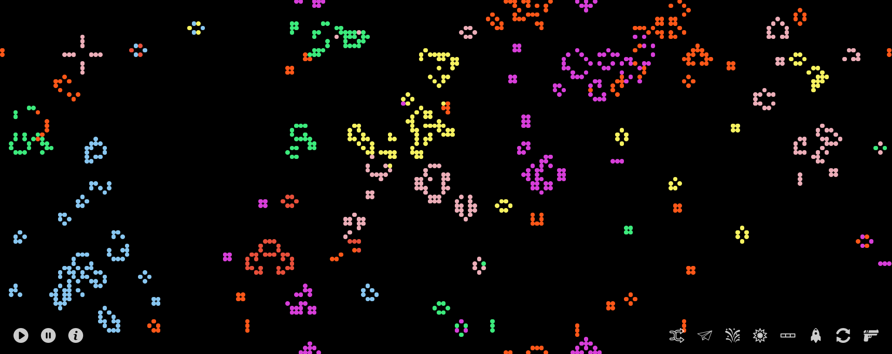

# Conways Game of Color

[View Demo]('http://trevoruptain.com')

This app is a simple, interactive browser version of Conway's Game of Life. It seeds each 'live' square with a random color upon initialization, with squares in successive states pulling a color randomly from their neighbors. It allows users to interact with the game during the run by dropping in preconfigured shapes, such as a 'spaceship' or 'gospel glider gun.'

## Technologies

Conway's Game of Color was written using vanilla JavaScript and jQuery, with Webpack used to bundle the various JavaScript files.

## Features

The primary feature of the app is its unique take on Conway's Game of Life, where a 2-dimensional grid is populated by 'live' and 'dead' squares which follow a simple set of rules:

* Any live cell with fewer than two live neighbors dies, as if caused by underpopulation
* Any live cell with two or three live neighbors lives on to the next generation
* Any live cell with more than three live neighbors dies, as if by overpopulation
* Any dead cell with exactly three live neighbors becomes a live cell, as if by reproduction

Unlike the typical Conway's Game, which is played on a grid of infinite height and width, the Game of Color wraps around the screen such that a traveling shape exiting the right of the screen will reappear on the left. Coupled with the game's unique color properties, the result is a chaotic explosion of movement and color as the user interacts with the game:



At any point during the run, a user can drop preconfigured shapes into the game using the icons at the bottom right of the screen. The can also pause or play the game using the controls at the left.

Preconfigured shapes are stored in the `util.js` file, and exist simply as a set of x and y coordinates relative to the position where they are dropped in:

```javascript

glider: [
  [1, 0],
  [0, 1],
  [-1, -1],
  [-1, 0],
  [-1, 1]
]
```

This repository also includes a drawing utility, which allows developers to paint the initial state as they wish. It outputs the coordinates of each painted square in a form where they can be pasted directly into the utility file and included in the constructor of `view.js` as the initial state of the board:

`this.positions = Util.newConfiguration;`
